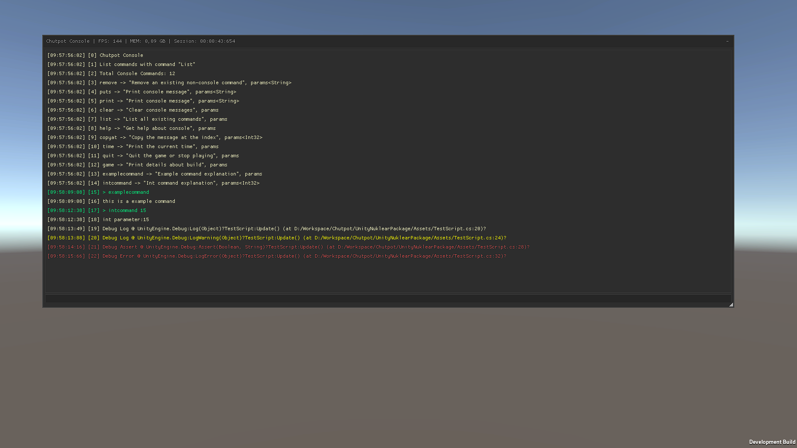

### Unity Nuklear Console

- Developer console for Editor and Development builds. Toggle Console with "~".

-------

### Installation
Unity does not support custom package dependencies so we need to add dependencies manually.
- Open package manager and add this package from git url : https://github.com/Chutpot/UnityNuklearLoaderPackage.git
- Add this package https://github.com/Chutpot/UnityNuklearConsolePackage.git
-------

### Usage
- Simply toggle console after Installation, the console is going to initialize itsef automaticaly.
#### Adding Commands
- To add static commands use  Attribute ```[ConsoleCommand(string commandName, string explanation)]```
- Any non-static commands with attributes will be ignored!
```c# 
#if UNITY_EDITOR || DEVELOPMENT_BUILD
    [ConsoleCommand("examplecommand", "Example command explanation")]
    public static void ExampleCommand()
    {
        Chutpot.Nuklear.Console.Console.Log("this is a example command");
    }

    [ConsoleCommand("intcommand", "Int command explanation")]
    public static void IntCommand(int x)
    {
        Chutpot.Nuklear.Console.Console.Log("int parameter:" + x);
    }
#endif
```
- Non-static Commands
```c#
    private void Awake()
    {
#if UNITY_EDITOR || DEVELOPMENT_BUILD
        Chutpot.Nuklear.Console.Console.AddCommand("nonstaticcommand", NonStaticCommand);
#endif
    }

    private void OnDestroy()
    {
#if UNITY_EDITOR || DEVELOPMENT_BUILD
        Chutpot.Nuklear.Console.Console.RemoveCommand("nonstaticcommand");
#endif        
    }

    private void NonStaticCommand() 
    {
    
    }
```
-------

### Support

| Input System                        |                    |
| -----------------                   | ------------------ |
| Legacy                              | :heavy_check_mark: |
| New Input System                    | :heavy_check_mark: |

-------
### TODO
- Better Parser
- Console Settings
-------
### Screenshots
